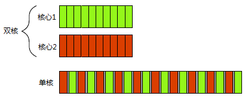

# 1.1 何谓并发

最简单和最基本的并发,是指两个或更多独立的活动同时发生。

并发在生活中随处可见，我们可以一边走路一边说话，也可以两只手同时作不同的动作，还有我们每个人都过着相互独立的生活——当我在游泳的时候，你可以看球赛，等等。

## 1.1.1 计算机系统中的并发

计算机领域的并发指的是在单个系统里同时执行多个独立的任务，而非顺序的进行一些活动。

计算机领域里，并发不是一个新事物：很多年前，一台计算机就能通过多任务操作系统的切换功能，同时运行多个应用程序；高端多处理器服务器在很早就已经实现了真正的并行计算。那“老东西”上有哪些“新东西”能让它在计算机领域越来越流行呢？——真正任务并行，而非一种错觉。

以前，大多数计算机只有一个处理器，具有单个*处理单元*(processing unit)或*核心*(core),如今还有很多这样的台式机。这种机器只能在某一时刻执行一个任务，不过它可以每秒进行多次任务切换。通过“这个任务做一会，再切换到别的任务，再做一会儿”的方式，让任务看起来是并行执行的。这种方式称为*任务切换*。如今,我们仍然将这样的系统称为*并发*:因为任务切换得太快，以至于无法感觉到任务在何时会被暂时挂起，而切换到另一个任务。任务切换会给用户和应用程序造成一种“并发的假象”。因为这种假象，当应用在任务切换的环境下和真正并发环境下执行相比，行为还是有着微妙的不同。特别是对内存模型不正确的假设(详见第5章),在多线程环境中可能不会出现(详见第10章)。

多处理器计算机用于服务器和高性能计算已有多年。基于单芯多核处理器(多核处理器)的台式机，也越来越大众化。无论拥有几个处理器，这些机器都能够真正的并行多个任务。我们称其为*硬件并发*(hardware concurrency)”。

图1.1显示了一个计算机处理恰好两个任务时的理想情景，每个任务被分为10个相等大小的块。在一个双核机器(具有两个处理核心)上，每个任务可以在各自的处理核心上执行。在单核机器上做任务切换时，每个任务的块交织进行。但它们中间有一小段分隔(图中所示灰色分隔条的厚度大于双核机器的分隔条);为了实现交织进行，系统每次从一个任务切换到另一个时都需要切换一次*上下文*(context switch)，任务切换也有时间开销。进行上下文的切换时，操作系统必须为当前运行的任务保存CPU的状态和指令指针，并计算出要切换到哪个任务，并为即将切换到的任务重新加载处理器状态。然后，CPU可能要将新任务的指令和数据的内存载入到缓存中，这会阻止CPU执行任何指令，从而造成的更多的延迟。

图 1.1 并发的两种方式：双核机器的真正并行 Vs. 单核机器的任务切换

有些处理器可以在一个核心上执行多个线程,但硬件并发在多处理器或多核系统上效果更加显著。*硬件线程*最重要的因素是数量,也就是硬件上可以并发运行多少独立的任务。即便是具有真正硬件并发的系统，也很容易拥有比硬件“可并行最大任务数”还要多的任务需要执行，所以任务切换在这些情况下仍然适用。例如，在一个典型的台式计算机上可能会有成百上千个的任务在运行，即便是在计算机处于空闲时，还是会有后台任务在运行。正是任务切换使得这些后台任务可以运行，并使得你可以同时运行文字处理器、编译器、编辑器和web浏览器(或其他应用的组合)。图1.2显示了四个任务在双核处理器上的任务切换，仍然是将任务整齐地划分为同等大小块的理想情况。实际上，许多因素会使得分割不均和调度不规则。部分因素将在第8章中讨论，那时我们再来看一看影响并行代码性能的因素。

无论应用程序在单核处理器，还是多核处理器上运行；也不论是任务切换还是真正的硬件并发，这里提到的技术、功能和类(本书所涉及的)都能使用得到。如何使用并发，将很大程度上取决于可用的硬件并发。我们将在第8章中再次讨论这个问题，并具体研究C++代码并行设计的问题。

图 1.2 四个任务在两个核心之间的切换

## 1.1.2 并发的途径

试想当两个程序员在两个独立的办公室一起做一个软件项目，他们可以安静地工作、不互相干扰，并且他们人手一套参考手册。但是，他们沟通起来就有些困难，比起可以直接互相交谈，他们必须使用电话、电子邮件或到对方的办公室进行直接交流。并且，管理两个办公室需要有一定的经费支出，还需要购买多份参考手册。

假设，让开发人员同在一间办公室办公，他们可以自由的对某个应用程序设计进行讨论，也可以在纸或白板上轻易的绘制图表，对设计观点进行辅助性阐释。现在，你只需要管理一个办公室，只要有一套参考资料就够了。遗憾的是，开发人员可能难以集中注意力，并且还可能存在资源共享的问题(比如，“参考手册哪去了?”)

以上两种方法，描绘了并发的两种基本途径。每个开发人员代表一个线程，每个办公室代表一个进程。第一种途径是每个进程只要一个线程，这就类似让每个开发人员拥有自己的办公室，而第二种途径是每个进程有多个线程，如同一个办公室里有两个开发人员。让我们在一个应用程序中简单的分析一下这两种途径。

##### 多进程并发

使用并发的第一种方法，是将应用程序分为多个独立的进程，它们在同一时刻运行，就像同时进行网页浏览和文字处理一样。如图1.3所示，独立的进程可以通过进程间常规的通信渠道传递讯息(信号、套接字、文件、管道等等)。不过，这种进程之间的通信通常不是设置复杂，就是速度慢，这是因为操作系统会在进程间提供了一定的保护措施，以避免一个进程去修改另一个进程的数据。还有一个缺点是，运行多个进程所需的固定开销：需要时间启动进程，操作系统需要内部资源来管理进程，等等。

当然，以上的机制也不是一无是处：操作系统在进程间提供附加的保护操作和更高级别的通信机制，意味着可以更容易编写安全的并发代码。实际上，在类似于Erlang(www.erlang.org/)的编程环境中，将进程作为并发的基本构造块。

使用多进程实现并发还有一个额外的优势———可以使用远程连接(可能需要联网)的方式，在不同的机器上运行独立的进程。虽然，这增加了通信成本，但在设计精良的系统上，这可能是一个提高并行可用行和性能的低成本方式。

图 1.3 一对并发运行的进程之间的通信

##### 多线程并发

并发的另一个途径，在单个进程中运行多个线程。线程很像轻量级的进程：每个线程相互独立运行，且线程可以在不同的指令序列中运行。但是，进程中的所有线程都共享地址空间，并且所有线程访问到大部分数据———全局变量仍然是全局的，指针、对象的引用或数据可以在线程之间传递。虽然，进程之间通常共享内存，但是这种共享通常是难以建立和管理的。因为，同一数据的内存地址在不同的进程中是不相同。图1.4展示了一个进程中的两个线程通过共享内存进行通信。

图 1.4 同一进程中的一对并发运行的线程之间的通信

地址空间共享，以及缺少线程间数据的保护，使得操作系统的记录工作量减小，所以使用多线程相关的开销远远小于使用多个进程。不过，共享内存的灵活性是有代价的：如果数据要被多个线程访问，那么程序员必须确保每个线程所访问到的数据是一致的(在本书第3、4、5和8章中会涉及，线程间数据共享可能会遇到的问题，以及如何使用工具来避免这些问题)。问题并非无解，只要在编写代码时适当地注意即可，这同样也意味着需要对线程通信做大量的工作。

多个单线程/进程间的通信(包含启动)要比单一进程中的多线程间的通信(包括启动)的开销大，若不考虑共享内存可能会带来的问题，多线程将会成为主流语言(包括C++)更青睐的并发途径。此外，C++标准并未对进程间通信提供任何原生支持，所以使用多进程的方式实现，这会依赖与平台相关的API。因此，本书只关注使用多线程的并发，并且在此之后所提到“并发”，均假设为多线程来实现。

在多线程应用中，还有一种方式被广泛应用：并行。让我们来了解一下并发和并行的区别。

## 1.1.3 并发与并行

对于多线程来说，这两个概念有很大部分是重叠的。对于很多人来说，它们的意思没有什么区别。其区别主要在于关注点和意图方面(差距甚微)。这两个词都是用来对硬件在同时执行多个任务的方式进行描述的术语，不过并行更加注重性能。在讨论使用当前可用硬件来提高批量数据处理的速度时，我们会讨论程序的并行性；当关注的重点在于任务分离或任务响应时，就会讨论到程序的并发性。这对术语没有明显的区别，并且还有很多意义上的重叠。这两个术语存在的目的，就是为了区别多线程程序中不同的关注点。本书中，将有两个例子对并行和并发进行演示。

了解并发后，让来看看为什么要使用并发。