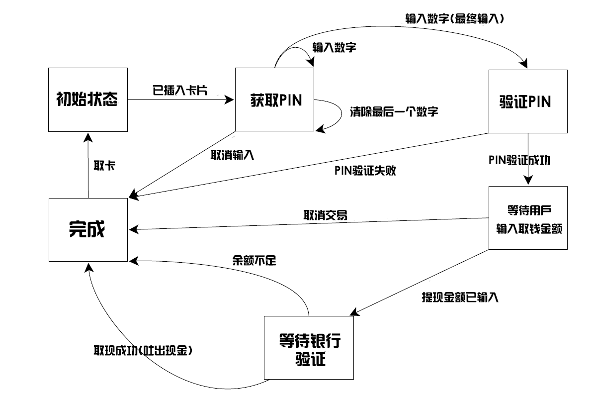

# 4.4 使用同步操作简化代码

同步工具的使用在本章称为构建块，你可以关注下那些需要同步的操作，而非使用具体的机制。当程序需要并发时，可提供更多的函数化的方法，帮助你简化代码。比起在多个线程间直接共享数据，每个任务拥有自己的数据会更好，并且结果可以使用期望值对其他线程进行广播。

### 4.4.1 使用期望值的函数化编程

术语*函数化编程*(functional programming)引用于一种编程方式，这种方式中的函数结果只依赖于传入函数的参数，并不依赖外部状态。当函数与数学概念相关时，使用相同的参数调用这个函数两次，两次的结果应该会完全相同。C++标准库中很多与数学相关的函数都有这个特性，例如，sin(正弦),cos(余弦)和sqrt(平方根)；当然，还有基本类型间的简单运算，例如，3+3，6*9，或1.3/4.7。纯粹的函数不会改变任何外部状态，并且这种特性完全限制了函数的返回值。

很容易想象这是种什么情况，特别是在并行发生时，因为在第3章我们讨论过，很多问题发生在共享数据上。当共享数据没有被修改，就不存在条件竞争，并且没有必要使用互斥量去保护共享数据。这是对编程极大的简化，例如Haskell语言[2]中函数默认就“纯粹的”；这种纯粹的方式，在并发编程中越来越受欢迎。因为大多数函数都是纯粹的，那么非纯粹的函数对共享数据的修改就显得更为突出，所以纯粹的函数很容易适应应用的整体结构。

函数化编程的好处，并不限于那些将“纯粹”作为默认方式(范型)的语言。C++是一个多范型的语言，也可以写出FP类型的程序。C++11的方式要比C++98简单许多，因为C++11支持Lambda表达式(详见附录A，A.6节)，还加入了[Boost](http://zh.wikipedia.org/wiki/Boost_C%2B%2B_Libraries)和[TR1](http://zh.wikipedia.org/wiki/C%2B%2B_Technical_Report_1)中的`std::bind`，以及自动可以自行推断类型的自动变量(详见附录A，A.7节)。期望值作为拼图的最后一块，它使得*函数化编程模式并发化*(FP-style concurrency)在C++中成为可能；期望值对象可以在线程间互相传递，并允许计算结果依赖于另外一个，而非对共享数据的显式访问。

**快速排序——FP模式版**

为了展示在*函数化*(PF)并发中使用期望值，让我们来看看一个简单的实现——快速排序算法。该算法的基本思想很简单：给定一个数据列表，然后选取其中一个数为“中间”值，之后将列表中的其他数值分成两组——一组比中间值大，另一组比中间值小。之后对小于“中间”值的组进行排序，并返回排序好的列表；再返回“中间”值；再对比“中间”值大的组进行排序，并返回排序的列表。图4.2中展示了10个整数在这种方式下进行排序的过程。


图4.2 FP-模式的递归排序

下面清单中的代码是FP-模式的顺序实现，需要传入列表，并且返回一个列表，与`std::sort()`做同样的事情不同。
(译者：`std::sort()`是无返回值的，因为参数接收的是迭代器，所以其可以对原始列表直进行修改与排序。可参考[sort()](http://www.cplusplus.com/reference/algorithm/sort/?kw=sort))

清单4.12 快速排序——顺序实现版

```c++
template<typename T>
std::list<T> sequential_quick_sort(std::list<T> input)
{
  if(input.empty())
  {
    return input;
  }
  std::list<T> result;
  result.splice(result.begin(),input,input.begin());  // 1
  T const& pivot=*result.begin();  // 2

  auto divide_point=std::partition(input.begin(),input.end(),
             [&](T const& t){return t<pivot;});  // 3

  std::list<T> lower_part;
  lower_part.splice(lower_part.end(),input,input.begin(),
             divide_point);  // 4
  auto new_lower(
             sequential_quick_sort(std::move(lower_part)));  // 5
  auto new_higher(
             sequential_quick_sort(std::move(input)));  // 6

  result.splice(result.end(),new_higher);  // 7
  result.splice(result.begin(),new_lower);  // 8
  return result;
}
```

虽然接口是FP模式的，但当使用FP模式时，需要做大量的拷贝操作，所以内部会使用“普通”的命令模式。选择第一个数为“中间”值，使用splice()①将输入的首个元素(中间值)放入结果列表中。虽然，这种方式产生的结果可能不是最优的(会有大量的比较和交换操作)，因为链表的访问方式是遍历，所以对`std::list`做任何事都需要花费较长的时间。这里清楚期望得到的结果，所以可以直接将“中间”值进行拼接。现在还需要使用“中间”值进行比较，所以使用了引用②，为的就是避免过多的拷贝。之后，可以使用`std::partition`将序列中的值分成小于“中间”值的组和大于“中间”值的组③。最简单的方法就是使用Lambda函数指定区分的标准，使用已获取的引用避免对“中间”值的拷贝(详见附录A，A.5节，更多有关Lambda函数的信息)。

`std::partition()`会对列表进行重置，并返回一个指向首元素(*不*小于“中间”值)的迭代器。迭代器的类型全称可能会很长，可以使用auto类型说明符，让编译器帮忙定义迭代器类型的变量(详见附录A，A.7节)。

现在，已经选择了FP模式的接口；所以，要使用递归对两部分排序，这需要创建两个列表。可以用splice()来做这件事，将input列表小于divided_point的值移动到新列表lower_part④中，其他数继续留在input列表中。而后，可以使用递归调用⑤⑥的方式，对两个列表进行排序。显式使用`std::move()`将列表传递到函数中，这还是为了避免大量的拷贝。最终，可以再次使用splice()，将result中的结果以正确的顺序进行拼接。new_higher指向的值放在“中间”值的后面⑦，new_lower指向的值放在“中间”值的前面⑧。

**快速排序——FP模式线程强化版**

函数化模式中，期望值很容易转化为并行版本，如下面的程序清单所示。其中的操作与前面相同，不同的是它们现在并行运行。

清单4.13 快速排序——期望值并行版

```c++
template<typename T>
std::list<T> parallel_quick_sort(std::list<T> input)
{
  if(input.empty())
  {
    return input;
  }
  std::list<T> result;
  result.splice(result.begin(),input,input.begin());
  T const& pivot=*result.begin();

  auto divide_point=std::partition(input.begin(),input.end(),
                [&](T const& t){return t<pivot;});
  
  std::list<T> lower_part;
  lower_part.splice(lower_part.end(),input,input.begin(),
                divide_point);

  std::future<std::list<T> > new_lower(  // 1
                std::async(&parallel_quick_sort<T>,std::move(lower_part)));

  auto new_higher(
                parallel_quick_sort(std::move(input)));  // 2

  result.splice(result.end(),new_higher);  // 3
  result.splice(result.begin(),new_lower.get());  // 4
  return result;
}
```

这里最大的变化是，当前线程不对小于“中间”值部分的列表进行排序，使用`std::async()`①在另一线程对其进行排序。大于部分列表，如同之前一样，使用递归的方式进行排序②。通过递归调用parallel_quick_sort()，就可以利用硬件并发了。`std::async()`会启动一个新线程，这样当递归三次时，就会有八个线程在运行了；当你递归十次(对于大约有1000个元素的列表)，如果硬件能处理这十次递归调用，将会创建1024个执行线程。当运行库认为这样做产生了太多的任务时(也许是因为数量超过了硬件并发的最大值)，运行库可能会同步的切换新产生的任务。当任务过多时(已影响性能)，为了避免任务想线程传递的开销，这些任务应该在使用get()函数获取结果的线程上运行，而不是在新线程上运行。值的注意的是这完全符合`std::async`的实现，为每一个任务启动一个线程(甚至是在任务超额时，也就是在`std::launch::deferred`没有明确规定的情况下)，或为了同步执行所有任务(在`std::launch::async`有明确规定的情况下)。当运行库的自动裁剪线程数量时，建议你去查看一下运行库的实现文档，了解一下将会有怎样的行为表现。

比起使用`std::async()`，这里可以写一个spawn_task()函数对`std::packaged_task`和`std::thread`做简单的包装，如清单4.14中的代码所示；需要为函数结果创建一个`std::packaged_task`对象， 并从这个对象中获取期望值，或在线程中执行它返回期望值。其本身并没有太多优势(事实上会造成大规模的超额任务)，但它可为转型成一个更复杂的实现铺平道路，实现将会向队列添加任务，而后使用线程池的方式来运行它们，第9章再来讨论线程池。使用`std::async`更适合于已知所有情况的任务，并且在线程池中构建或执行过任务的线程要能完全控制。

清单4.14 spawn_task的简单实现

```c++
template<typename F,typename A>
std::future<std::result_of<F(A&&)>::type>
   spawn_task(F&& f,A&& a)
{
  typedef std::result_of<F(A&&)>::type result_type;
  std::packaged_task<result_type(A&&)>
       task(std::move(f)));
  std::future<result_type> res(task.get_future());
  std::thread t(std::move(task),std::move(a));
  t.detach();
  return res;
}
```

其他先不管，回到parallel_quick_sort函数。因为只是直接递归去获取new_higher列表，就可以如之前一样对new_higher进行拼接③。但是，new_lower列表是`std::future<std::list<T>>`的实例，而非是一个简单的列表，所以需要调用get()成员函数在调用splice()④之前去检索数值。之后，等待后台任务完成，并且将结果移入splice()调用中；get()返回一个包含结果的右值引用，这样结果就是可以移动的(详见附录A，A.1.1节，有更多有关右值引用和移动语义的信息)。

假设使用`std::async()`是对可用硬件并发最好的选择，但这样的并行实现对于快速排序来说，依然不是最理想的。其中，`std::partition`做了很多工作，即使做了依旧是顺序调用，但就现在的情况而言，已经足够好了。如果对实现最快并行感兴趣的话，可以去查阅一些学术文献。或者，可以选择C++17中的并行重载版本(详见第10章)。

因避开了共享可变数据，函数化编程可算作是并发编程的范型，并且也是*通讯顺序进程*(CSP，Communicating Sequential Processer[3])的范型，这里的线程理论上是完全分开的，也就是没有共享数据，但是有通讯通道允许信息在不同线程间进行传递。这种范型被[Erlang语言](http://www.erlang.org)所采纳，并且在[MPI](http://www.mpi-forum.org)(*Message Passing Interface*，消息传递接口)上常用来做C和C++的高性能运算。现在应该不会在对学习它们而感到惊奇了吧，因为只需遵守一些约定，C++就能支持它们；在接下来的一节中，我们会讨论实现这种方式。

### 4.4.2 使用消息传递的同步操作

CSP的概念十分简单：当没有共享数据时，每个线程可以进行独立思考，其行为纯粹基于所接收到的信息。每个线程就都有自己的状态机：当线程收到一条信息，会以某种方式更新状态，并且可能向其他线程发出一条或多条信息，消息的处理机制依赖于线程的初始化状态。这是一种将其形式以有限状态机的模式实现，但是并不是唯一的方案；状态机可以在应用程序中隐式实现。这种方法在任何情况下，都更加依赖于明确的行为要求和编程团队的专业知识。无论选择用哪种方式去实现每个线程，任务都会有独立的处理部分，这样就能消除潜在的混乱(数据共享并发)，这就让编程变的更加简单，且降低错误率。

真正通讯顺序处理没有共享数据，所有消息都是通过消息队列传递，但C++线程共享一块地址空间，所以达不到真正通讯顺序处理的要求。这就需要一些约定来支持：作为应用或是库作者，我们有责任确保在实现中，线程不存在共享数据。当然，为了线程间的通信，消息队列必须共享，具体的细节要包含在库中。

试想有一天你要为实现ATM(自动取款机)写一个应用。这个应用需要处理：人们尝试取钱时和银行之间的交互情况，以及控制物理器械接受用户的卡片，显示适当的信息，处理按钮事件，吐出现金，还有退还用户的卡。

一种处理方法是让代码将所有事情分配到三个独立线程上去：一个线程去处理物理机械，一个去处理ATM机的逻辑，还有一个用来与银行通讯。这些线程可以通过信息进行纯粹的通讯，而不共享任何数据。比如，当有人在ATM机上插入了卡片或者按下按钮，处理物理机械的线程将会发送一条信息到逻辑线程上，并且逻辑线程将会发送一条消息到机械线程，告诉机械线程可以分配多少钱，等等。

一种为ATM机逻辑建模的方式，就是将其当做一个状态机。线程的每一个状态都会等待一条可接受的信息，这条信息包含需要处理的内容。这会让线程过渡到新的状态，并且继续循环。图4.3中将展示有状态参与的一个简单是实现。这个简化实现中，系统在等待一张卡插入。当有卡插入时，系统将会等待用户输入PIN(类似身份码的东西)，每次输入一个数字。用户可以将最后输入的数字删除。当数字输入完成，需要验证PIN。当验证有问题时，程序就需要终止，就需要为用户退出卡，并且继续等待其他人将卡插入到机器中；当验证通过时，程序要等待用户取消交易或选择取款。当用户选择取消交易，程序可以结束，并返还卡片。当用户选择取出一定量的现金，程序就要在吐出现金和返还卡片前等待银行方面的确认，或显示“余额不足”的信息，并返还卡片。很明显，一个真正的ATM机要考虑的东西更多、更复杂，但是对于我们来说，这样描述已经足够了。



图4.3 一台ATM机的状态机模型(简化)

我们已经为你的ATM机逻辑设计了一个状态机，可以使用一个类实现它，这个类中有一个成员函数可以代表每一个状态。每一个成员函数可以等待从指定集合中传入的信息，以及当它们到达时进行处理，这就有可能触发原始状态向另一个状态的转化。每种不同的信息类型由一个独立的struct表示。清单4.15展示了ATM逻辑部分的简单实现(以上描述的系统中，有主循环和对第一状态的实现)，并且一直在等待卡片插入。

如你所见，所有信息传递所需的的同步，完全包含在“信息传递”库中(基本实现在附录C中，是清单4.15代码的完整版)

清单4.15 ATM逻辑类的简单实现

```c++
struct card_inserted
{
  std::string account;
};

class atm
{
  messaging::receiver incoming;
  messaging::sender bank;
  messaging::sender interface_hardware;
  void (atm::*state)();

  std::string account;
  std::string pin;

  void waiting_for_card()  // 1
  {
    interface_hardware.send(display_enter_card());  // 2
    incoming.wait().  // 3
      handle<card_inserted>(
      [&](card_inserted const& msg)  // 4
      {
       account=msg.account;
       pin="";
       interface_hardware.send(display_enter_pin());
       state=&atm::getting_pin;
      }
    );
  }
  void getting_pin();
public:
  void run()  // 5
  {
    state=&atm::waiting_for_card;  // 6
    try
    {
      for(;;)
      {
        (this->*state)();  // 7
      }
    }
    catch(messaging::close_queue const&)
    {
    }
  }
};
```

之前提到的，这个实现对于实际ATM机的逻辑来说非常简单，但是能让你感受到信息传递编程的方式。这里无需考虑同步和并发问题，只需要考虑什么时候接收信息和发送信息即可。为ATM逻辑所设的状态机运行在独立的线程上，与系统的其他部分一起，比如：与银行通讯的接口，以及运行在独立线程上的终端接口。这种程序设计的方式被称为*参与者模式*([Actor model](http://zh.wikipedia.org/wiki/%E5%8F%83%E8%88%87%E8%80%85%E6%A8%A1%E5%BC%8F))——在系统中有很多独立的(运行在一个独立的线程上)参与者，这些参与者会互相发送信息，去执行手头上的任务，并且不会共享状态，除非是通过信息直接传入的。

运行从run()成员函数开始⑤，初始化waiting_for_card⑥的状态，然后反复执行当前状态的成员函数(无论这个状态时怎么样的)⑦。状态函数是简易atm类的成员函数。wait_for_card函数①依旧很简单：它发送一条信息到接口，让终端显示“等待卡片”的信息②，之后就等待传入一条消息进行处理③。处理的消息类型只能是card_inserted类的，这里使用一个Lambda函数④对其进行处理。当然，可以传递任何函数或函数对象去处理函数，但对于一个简单的例子来说，使用Lambda表达式是最简单的方式。注意，handle()函数调用与wait()函数进行连接的；当收到的信息类型与处理类型不匹配，收到的信息将会被丢弃，并且线程继续等待，直到接收到一条类型匹配的消息。

Lambda函数自身只是将用户的账号信息缓存到一个成员变量中去，并且清除PIN信息，再发送一条消息到硬件接口，让显示界面提示用户输入PIN，然后将线程状态改为“获取PIN”。当消息处理程序结束，状态函数就会返回，然后主循环会调用新的状态函数⑦。

如图4.3，getting_pin状态函数会负载一些，因为其要处理三个不同的信息类型。具体代码展示如下：

清单4.16 简单ATM实现中的getting_pin状态函数

```c++
void atm::getting_pin()
{
  incoming.wait()
    .handle<digit_pressed>(  // 1
      [&](digit_pressed const& msg)
      {
        unsigned const pin_length=4;
        pin+=msg.digit;
        if(pin.length()==pin_length)
        {
          bank.send(verify_pin(account,pin,incoming));
          state=&atm::verifying_pin;
        }
      }
      )
    .handle<clear_last_pressed>(  // 2
      [&](clear_last_pressed const& msg)
      {
        if(!pin.empty())
        {
          pin.resize(pin.length()-1);
        }
      }
      )
    .handle<cancel_pressed>(  // 3
      [&](cancel_pressed const& msg)
      {
        state=&atm::done_processing;
      }
      );
}
```

这次需要处理三种消息类型，所以wait()函数后面接了三个handle()函数调用①②③。每个handle()都有对应的消息类型作为模板参数，并且将消息传入一个Lambda函数中(其获取消息类型作为一个参数)。因为调用都被连接在了一起，wait()的实现知道它是等待一条digit_pressed消息，或是一条clear_last_pressed肖息，亦或是一条cancel_pressed消息，这样其他的消息类型将会被丢弃。

当获取一条消息时，无需再去改变状态。比如，当获取一条digit_pressed消息时，仅需要将其添加到pin中，除非那些数字是最终的输入。(清单4.15中)主循环⑦将会再次调用getting_pin()去等待下一个数字(或清除数字，或取消交易)。

这里对应的动作如图4.3所示，每个状态盒的实现都由一个不同的成员函数构成，等待相关信息并适当的更新状态。

一个并发系统中，这种编程方式可以极大的简化任务的设计，因为每一个线程都完全被独立对待。因此，使用多线程去分离关注点时，需要明确线程之间的任务应该如何分配。

### 4.4.3 并发技术规范中的持续性并发

并发技术规范在`std::experiment`命名空间中提供了新的`std::promise`和`std::packaged_taks`，其与`std`命名空间中类型完全不同：其返回实例类型为`std::experimental::future`，而不是`std::future`。这能让使用体会`std::experimental::future`所带来的新特性——持续性。

假设你的任务运行会产生一个结果，并且期望值持有这个结果。然后，你需要写一些代码来处理这个结果。使用`std::future`时，你必须等待期望值状态变为就绪态，要不就使用权阻塞成员函数wait()，或是使用wait_for()/wait_unitl()成员函数直到等待超时。这就会让代码变得非常复杂。你想要用一句话来说，就是“完事俱备，只等数据”。这也就是持续性添加的意义；为了给期望值添加持续性，只需要在成员函数后添加then()即可。比如：给定一个期望值fut，添加持续性的调用即为fut.then(continuation)。

与`std::future`类似 ,  `std::experimental::future`存储的值也只能检索一次。如果期望值正处于持续使用状态，那么这个期望值就不能被其他代码所访问。因此，当使用fut.then()为fut期望值添加持续性后，对原始期望值fut的操作就是非法的。另外，调用fut.then()会返回一个新的期望值，这个新的期望值会持有持续调用的结果。具体如下代码所示：

```c++
std::experimental::future<int> find_the_answer;
auto fut=find_the_answer();
auto fut2=fut.then(find_the_question);
assert(!fut.valid());
assert(fut2.valid());
```

当原始期望值为就绪态，find_the_question持续性函数没有安排在指定的线程上运行。这就给予了具体的自由，函数可以在一个线程池或是在另一个线程管理库上运行。其实这是经过考虑的，就是在将持续性引入C++标准时，让实现者能给予其丰富的经验，更好的指定线程的选择，并为用户提供合适的机制来控制线程。

与直接调用`std::async`或`std::thread`不同，持续性函数不需要传入参数，因为运行库已经为其定义好了参数——会传入一个就绪态持续性期望值，这个期望值保存了持续性触发后的结果。假设find_the_answer返回类型为int，find_the_question函数根据之前的例子将会传入一个` std::experimental::future<int> `作为唯一参数：

```c++
std::string find_the_question(std::experimental::future<int> the_answer);
```

这样做的原因是，持续性的期望之中会持有一个具体值或是一个异常。如果期望被隐式的解引用，将其值直接传递给持续性函数，那么运行库将会具体决定如何处理这种异常；反之，将期望值传递给持续性函数，那么持续性函数降回来处理这个异常。举个简单的例子，也就是通过fut.get()获取期望值持有的值，并且在持续性函数外将异常重新抛出并传播。就如同将函数传入`std::async`一样，异常存在于持有持续性结果的期望值中，这样异常就会逃出函数，从而进行传播。

需要注意的是，并发技术规范中没有指定这种情况等价于`std::async`，但实现可以提供这一扩展。这种函数写起来也很简单：使用`std::experimental::promise`来获取一个期望值，并且生成一个新的线程运行Lambda表达式，该Lambda表达式为承诺值设置给定函数的返回值，代码如下所示。

清单4.17 使用并发技术规范中的特性，实现与`std::async`等价的功能

```c++
template<typename Func>
std::experimental::future<decltype(std::declval<Func>()())>
spawn_async(Func&& func){
  std::experimental::promise<
    decltype(std::declval<Func>()())> p;
  auto res=p.get_future();
  std::thread t(
    [p=std::move(p),f=std::decay_t<Func>(func)]()
      mutable{
      try{
        p.set_value_at_thread_exit(f());
      } catch(...){
        p.set_exception_at_thread_exit(std::current_exception());
      }
  });
  t.detach();
  return res;
}
```

和`std::aync`一样，这里将函数的结果存储在期望值中，或捕获函数抛出的异常，将异常存到期望值中。同样的，这里为了保证在期望值达到就绪态时，thread_local变量已经使用set_value_at_thread_exit和set_exception_at_thread_exit清理过了。

值是从一个then()调用中返回，其返回的期望值是一个完整的期望值。这也就以为着，你可以对持续性进行连接。

### 4.4.4 持续性连接

假设你有一些列耗费时间的任务要完成，并且你想要使用多线程的方式异步完成这些任务，从而对减轻主线程上的计算压力。例如：当有用户登录了你的应用，你需要将登录凭证发送给后台；然后，对身份信息进行验证后，进一步从后台索取用户的账户信息；最后，当索引到相关信息后，使用获取到的信息对显示进行更新。串行执行的话，可以写成如下的方式：

清单4.18 处理用户登录——串行函数

```c++
void process_login(std::string const& username, std::string const& password)
{
  try{
    user_id const id = backend.authenticate_user(username, password);
    user_data const info_to_display = backend.request_current_info(id);
    update_display(info_to_display);
  } catch(std::exception& e){
    display_error(e);
  }
}
```

不过，你不想要串行代码吧；你想要的是一段异步代码，所以不想阻塞UI线程。使用`std::async`可以将另一个列表全部放在后台线程上，不过这依旧会阻塞UI线程，在等待这些任务完成的同时，会消耗大量的资源。如果你有很多这样的任务，那么可以结束一些那些只在等待的线程，从而节省资源。

清单4.19 处理用户登录——异步方式

```c++
std::future<void> process_login(
  std::string const& username, std::string const& password)
{
  return std::async(std::launch::async,[=](){
    try{
      user_id consst id = backend.authenticate_user(username, password);
      user_data const info_to_display = 
        backend.request_current_info(id);
      update_display(info_to_display);
    } catch(std::exception& e){
      display_error(e);
    }      
  });
}
```

为了避免阻塞相应线程，需要有机制对每个完成的任务进行连接：持续性。下面的代码清单展示的处理过程总体相同，但这次将整个任务分成了一系列任务，并且每个任务在完成的时候回连接到前一个任务上。

清单4.20 处理用户登录——持续性方式

```c++
std::experimental::future<void> process_login(
  std::string const& username, std::string const& password)
{
  return spawn_async([=](){
    return backend.authenticate_user(username, password);  
  }).then([](std::experimental::future<user_id> id){
    return backend.request_current_info(id.get());
  }).then([](std::experimental::future<user_data> info_to_display){
    try{
      update_display(info_to_display.get());
    } catch(std::exception& e){
      display_error(e);
    }
  });
}
```

需要注意的是每个持续性函数都有一个`std::experimental::future`作为独立参数，然后使用`.get()`来获取其拥有的值。这意味着异常会沿着这个链条进行传播，如果有函数抛出异常，那么就会在调用info_to_display.get()时抛出，这里的捕获结构可以处理所有的异常类型，就想清单4.18的catch那样。

因为需要等待消息通过网络或数据操作进行传输，所函数内部会对后端模块进行调用，但这时前端的任务还没有完成。可能已经将任务进行分割成独立的小任务，但它们仍然会阻塞调用，这样就会阻塞线程的运行，这里需要在后端任务完成时，前端处理就已经将结果处理好，而不是对线程进行阻塞。这样的话， backend.async_authenticate_user(username,password)返回` std::experimental::future<user_id> `会比返回user_id更加合适。

你可能觉得这段代码比较复杂，因为从持续函数返回的期望值类型为`future<future<some_value>>`，否则你只能将调用`.then`的语句放置在持续函数中。如果你这么想，你就错了，因为持续性支持一种极为精妙的特性，叫做*期望值展开*(future-unwrapping)。当你向`.then()`传递了持续性函数，并且返回一个future<some_type>类型的值，相应的`.then()`的返回值类型也是future<some_type>。最终的代码可能如下清单所示，这样在异步函数链上就不会存在阻塞了。

清单4.21  处理用户登录——全异步操作

```c++
std::experimental::future<void> process_login(
  std::string const& username, std::string const& password)
{
  return backend.async_authenticate_user(username, password).then(
    [](std::experimental::future<user_id> id){
      return backend.async_request_current_info(id.get());      
    }).then([](std::experimental::future<user_data> info_to_display){
      try{
        update_display(info_to_display.get());  
      } catch(std::exception& e){
        display_error(e);
      }
    });
}
```

这和清单4.18的代码几乎一模一样，区别就是Lambda表达式和将相应的功能包裹在`.then`的调用中。如果所用编译器支持C++14泛型Lambda表达式，那么Lambda表达式的参数列表中的类型可以使用auto替换，例如：

```c++
return backend.async_authenticate_user(username, password).then(
    [](auto id){
      return backend.async_request_current_info(id.get());
    });
```

如果需要比较简单的线性控制流来控制比较复杂的东西，可以使用Lambda表达式来实现一些逻辑功能；如果控制流是真的很复杂，那么就需要单独写一个函数来完成这件事了。

目前，我们一直讲注意力放在支持持续性的`std::experimental::future`上。`std::experimental::shared_future`同样支持持续性。二者的区别在于，`std::experimental::shared_future`对象可以具有多个持续性对象，不并且持续性参数是` std::experimental::shared_future`，而不是`std::experimental::future`。`std::experimental::shared_future`脱离了共享的本性——因为多个对象可以引用相同的共享状态，如果只允许一个延续，那么多个线程的情况下就会产生条件竞争，每个线程都试图将持续性对象添加到在自己的`std::experimental::shared_future`对象中。这种情况的确很糟糕，所以允许多持续性的存在。当使用多持续性时，可以通过同一个`std::experimental::shared_future`对象对其进行添加，而不用每个对象中只允许有一个持续性。另外，当你只打算给第二个持续性传递对象时，不能给第一个持续性的传递一个临时`std::experimental::shared_future`对象。因此，传递给延续性函数的参数也必须是`std::experimental::shared_future`对象。

```c++
auto fut = spawn_async(some_function).share();
auto fut2 = fut.then([](std::experimental::shared_future<some_data> data){
      do_stuff(data);
    });
auto fut3 = fut.then([](std::experimental::shared_future<some_data> data){
      return do_other_stuff(data);
    });
```

由于调用了`share()`，fut是一个`std::experimental::share_future`实例，这是因为持续性函数必须将`std::experimental::shared_future`对象作为参数。不过，持续性返回的值为`std::experimental::future`——目前这个值无法共享——所以fut2和fut3的类型都是`  std::experimental::future`。

在并发技术规范中，持续性只是增强期望值能力的一种方式而已，不过这种方式可能是最重要的。另外还提供了两个超载函数，可以将期望值分组，并等待其中一组中的任意一个期望值状态为就绪，或是等待一组中的所有期望值状态为就绪。

### 4.4.5 等待多个期望值

### 4.4.6 使用when_any等待第一个期望值

### 4.4.7 并发技术规范中的锁存器和栅栏机制

### 4.4.8 std::experimental::latch：基础的锁存器类型

### 4.4.9 std::experimental::barrier：简单的栅栏机制

### 4.4.10  std::experimental::flex_barrier—更灵活和友好版std::experimental::barrier
---------

[2] 详见 http://www.haskell.org/.

[3] 《通信顺序进程》(*Communicating Sequential Processes*), C.A.R. Hoare, Prentice Hall, 1985. 免费在线阅读地址 http://www.usingcsp.com/cspbook.pdf.