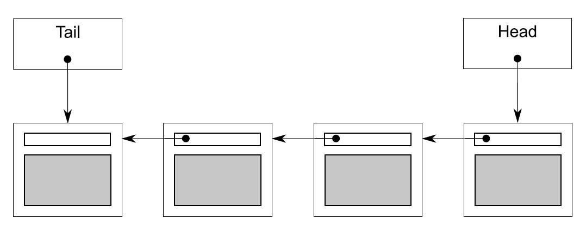

# 6.2 基于锁的并发数据结构

基于锁的并发数据结构，需要确保访问线程持有锁的时间最短，对于只有一个互斥量的数据结构来说，这十分困难。需要保证数据不被锁之外的操作所访问，并且还要保证不会在结构上产生条件竞争(如第3章所述)。使用多个互斥量来保护数据结构中不同的区域时，问题会暴露的更加明显，当操作需要获取多个互斥锁时，就有可能产生死锁。所以在设计时，使用多个互斥量时需要格外小心。

在本节中，你将使用6.1.1节中的指导建议，来设计一些简单的数据结构——使用互斥量和锁的方式来保护数据。每一个例子中，都是在保证数据结构是线程安全的前提下，对数据结构并发访问的概率(机会)进行提高。

我们先来看看在第3章中*栈*的实现，这个实现就是一个十分简单的数据结构，它只使用了一个互斥量。但是，这个结构是线程安全的吗？它离真正的并发访问又有多远呢？

## 6.2.1 线程安全栈——使用锁

我们先把第3章中线程安全的栈拿过来看看：(试图实现一个线程安全版的`std:stack<>`)

清单6.1 线程安全栈的类定义

```c++
#include <exception>

struct empty_stack: std::exception
{
  const char* what() const throw();
};

template<typename T>
class threadsafe_stack
{
private:
  std::stack<T> data;
  mutable std::mutex m;
public:
  threadsafe_stack(){}
  threadsafe_stack(const threadsafe_stack& other)
  {
    std::lock_guard<std::mutex> lock(other.m);
    data=other.data;
  }

  threadsafe_stack& operator=(const threadsafe_stack&) = delete;

  void push(T new_value)
  {
    std::lock_guard<std::mutex> lock(m);
    data.push(std::move(new_value));  // 1
  }
  std::shared_ptr<T> pop()
  {
    std::lock_guard<std::mutex> lock(m);
    if(data.empty()) throw empty_stack();  // 2
    std::shared_ptr<T> const res(
      std::make_shared<T>(std::move(data.top())));  // 3
    data.pop();  // 4
    return res;
  }
  void pop(T& value)
  {
    std::lock_guard<std::mutex> lock(m);
    if(data.empty()) throw empty_stack();
    value=std::move(data.top());  // 5
    data.pop();  // 6
  }
  bool empty() const
  {
    std::lock_guard<std::mutex> lock(m);
    return data.empty();
  }
};
```

来看看是如何应用指导意见的。

首先，互斥量m可保证线程安全，就是对每个成员函数进行加锁保护。保证在同一时间内，只有一个线程可以访问到数据，所以能够保证修改数据结构的“不变量”时，不会被其他线程看到。

其次，在empty()和pop()成员函数之间会存在竞争，不过代码会在pop()函数上锁时，显式的查询栈是否为空，所以这里的竞争不是恶性的。pop()直接返回弹出值，就可避免`std::stack<>`中top()和pop()两成员函数之间的潜在竞争。

再次，类中也有一些异常源。对互斥量上锁可能会抛出异常，因为上锁操作是每个成员函数所做的第一个操作，所以这是极其罕见的(这意味这问题不在锁上，就是在系统资源上)。因无数据修改，所以是安全的。因解锁一个互斥量是不会失败的，所以段代码很安全，并且使用`std::lock_guard<>`也能保证互斥量上锁的状态。

对data.push()①的调用可能会抛出一个异常，不是拷贝/移动数据值，就是内存不足。不管是哪种情况，`std::stack<>`都能保证其安全性，所以这里也没有问题。

第一个重载的pop()中，代码可能会抛出一个empty_stack的异常②，不过数据没有被修改，所以是安全的。对于res的创建③，也可能会抛出一个异常，有两方面的原因：对`std::make_shared`的调用，可能无法分配出足够的内存去创建新的对象，并且内部数据需要对新对象进行引用；或者在拷贝或移动构造到新分配的内存中返回时抛出异常。两种情况下，C++运行库和标准库能确保不会出现内存泄露，并且新创建的对象(如果有的话)都能被正确销毁。因为没有对栈进行任何修改，所以也不会有问题。当调用data.pop()④时，能确保不抛出异常并返回结果，所以这个重载pop()函数是“异常-安全”的。

第二个重载pop()除了在拷贝赋值或移动赋值时会抛出异常⑤，当构造新对象和`std::shared_ptr`实例时都不会抛出异常。同样，调用data.pop()⑥(这个成员函数保证不会抛出异常)之前，依旧没有对数据结构进行修改，所以这个函数也为“异常-安全”。

最后，empty()不会修改任何数据，所以也是“异常-安全”函数。

当调用持有一个锁的用户代码时，有两个地方可能会死锁：拷贝构造或移动构造(①，③)和拷贝赋值或移动赋值操作⑤；还有一个潜在死锁的地方在于用户定义的new操作符。无论是以直接调用栈的成员函数的方式，还是在成员函数进行操作时，对已经插入或删除的数据进行操作的方式，对锁进行获取，都可能造成死锁。不过，用户要对栈负责，当栈未对数据进行拷贝或分配时，用户就不能随意的将其添加到栈中。

所有成员函数都使用`std::lock_guard<>`保护数据，所以栈成员函数才是“线程安全”的。当然，构造与析构函数不是“线程安全”的，不过也没关系，因为构造与析构只有一次。调用一个不完全构造对象或是已销毁对象的成员函数，无论在那种编程方式下都不可取。所以，用户就要保证在栈对象完成构建前，其他线程无法对其进行访问；并且，一定要保证在栈对象销毁后，所有线程都要停止对其进行访问。

即使在多线程下，并发调用的成员函数也是安全的(因为使用锁)。同时，要保证在单线程的情况下，数据结构做出正确反应。序列化线程会隐性的限制程序性能，这就是栈争议声最大的地方：当一个线程在等待锁时，就会无所事事。对于栈来说，等待添加元素也是没有意义的，所以当线程需要等待时，会定期检查empty()或pop()，以及对empty_stack异常进行关注。这样的现实会限制栈的实现方式，线程等待时会浪费宝贵的资源去检查数据，或要求用户编写外部等待和提示的代码(例如：使用条件变量)，这就使内部锁失去存在的意义——也就造成资源的浪费。第4章中的队列，就是使用条件内部变量进行等待的数据结构，接下来我们就来了解一下。

## 6.2.2 线程安全队列——使用锁和条件变量

在清单6.2中重现一下第4章中的线程安全队列，与使用仿`std::stack<>`建立的栈很像，这里队列的建立也是参照了`std::queue<>`。不过，与标准容器的接口不同，我们要设计的是线程安全的数据结构。

清单6.2 使用条件变量实现的线程安全队列

```c++
template<typename T>
class threadsafe_queue
{
private:
  mutable std::mutex mut;
  std::queue<T> data_queue;
  std::condition_variable data_cond;

public:
  threadsafe_queue()
  {}

  void push(T new_value)
  {
    std::lock_guard<std::mutex> lk(mut);
    data_queue.push(std::move(data));
    data_cond.notify_one();  // 1
  }

  void wait_and_pop(T& value)  // 2
  {
    std::unique_lock<std::mutex> lk(mut);
    data_cond.wait(lk,[this]{return !data_queue.empty();});
    value=std::move(data_queue.front());
    data_queue.pop();
  }

  std::shared_ptr<T> wait_and_pop()  // 3
  {
    std::unique_lock<std::mutex> lk(mut);
    data_cond.wait(lk,[this]{return !data_queue.empty();});  // 4
    std::shared_ptr<T> res(
      std::make_shared<T>(std::move(data_queue.front())));
    data_queue.pop();
    return res;
  }

  bool try_pop(T& value)
  {
    std::lock_guard<std::mutex> lk(mut);
    if(data_queue.empty())
      return false;
    value=std::move(data_queue.front());
    data_queue.pop();
    return true;
  }

  std::shared_ptr<T> try_pop()
  {
    std::lock_guard<std::mutex> lk(mut);
    if(data_queue.empty())
      return std::shared_ptr<T>();  // 5
    std::shared_ptr<T> res(
      std::make_shared<T>(std::move(data_queue.front())));
    data_queue.pop();
    return res;
  }

  bool empty() const
  {
    std::lock_guard<std::mutex> lk(mut);
    return data_queue.empty();
  }
};
```

除了在push()①中调用data_cond.notify_one()，以及wait_and_pop()②③，6.2中对队列的实现与6.1中对栈的实现类似。两个重载try_pop()除了在队列为空时抛出异常，其他的与6.1中pop()函数完全一样。不同的是，6.1中对值的检索会返回一个bool值，而6.2中当指针指向空值的时候会返回NULL指针⑤，这也是实现栈的一个有效方式。所以，即使排除掉wait_and_pop()函数，之前对栈的分析依旧适用于这里。

wiat_and_pop()函数是等待队列向栈进行输入的一个解决方案；比起持续调用empty()，等待线程调用wait_and_pop()函数和条件变量的方式要好很多。对于data_cond.wait()的调用，直到队列中有一个元素的时候才会返回，所以不用担心会出现一个空队列的情况，且数据会一直被互斥锁保护。因为不变量并未发生变化，所以函数不会增加新的条件竞争或死锁的可能。

异常安全会有一些变化，不止一个线程等待对队列进行推送操作时，只会有一个线程因data_cond.notify_one()而继续工作着。但是，如果这个工作线程在wait_and_pop()中抛出一个异常，例如：构造新的`std::shared_ptr<>`对象④时抛出异常，那么其他线程则会永世长眠。这种情况是不可接受的，所以调用函数就需要改成data_cond.notify_all()，这个函数将唤醒所有的工作线程，不过当大多线程发现队列依旧是空时，又会耗费很多资源让线程重新进入睡眠状态。第二种替代方案是，有异常抛出的时，让wait_and_pop()函数调用notify_one()，从而让个另一个线程可以去尝试索引存储的值。第三种替代方案是，将`std::shared_ptr<>`的初始化过程移到push()中，并且存储`std::shared_ptr<>`实例，而不是直接使用数据的值。将`std::shared_ptr<>`拷贝到内部`std::queue<>`中就不会抛出异常了，这样wait_and_pop()又是安全的了。下面的程序清单，就是根据第三种方案进行修改的。

清单6.3 持有`std::shared_ptr<>`实例的线程安全队列

```c++
template<typename T>
class threadsafe_queue
{
private:
  mutable std::mutex mut;
  std::queue<std::shared_ptr<T> > data_queue;
  std::condition_variable data_cond;
public:
  threadsafe_queue()
  {}

  void wait_and_pop(T& value)
  {
    std::unique_lock<std::mutex> lk(mut);
    data_cond.wait(lk,[this]{return !data_queue.empty();});
    value=std::move(*data_queue.front());  // 1
    data_queue.pop();
  }

  bool try_pop(T& value)
  {
    std::lock_guard<std::mutex> lk(mut);
    if(data_queue.empty())
      return false;
    value=std::move(*data_queue.front());  // 2
    data_queue.pop();
    return true;
  }

  std::shared_ptr<T> wait_and_pop()
  {
    std::unique_lock<std::mutex> lk(mut);
    data_cond.wait(lk,[this]{return !data_queue.empty();});
    std::shared_ptr<T> res=data_queue.front();  // 3
    data_queue.pop();
    return res;
  }

  std::shared_ptr<T> try_pop()
  {
    std::lock_guard<std::mutex> lk(mut);
    if(data_queue.empty())
      return std::shared_ptr<T>();
    std::shared_ptr<T> res=data_queue.front();  // 4
    data_queue.pop();
    return res;
  }

  void push(T new_value)
  {
    std::shared_ptr<T> data(
    std::make_shared<T>(std::move(new_value)));  // 5
    std::lock_guard<std::mutex> lk(mut);
    data_queue.push(data);
    data_cond.notify_one();
  }

  bool empty() const
  {
    std::lock_guard<std::mutex> lk(mut);
    return data_queue.empty();
  }
};
```

为让`std::shared_ptr<>`持有数据的结果显而易见：弹出函数会持有一个变量的引用，为了接收这个新值，必须对存储的指针进行解引用①②；并且，返回调用函数前，弹出函数都会返回一个`std::shared_ptr<>`实例，实例可以在队列中检索③④。

`std::shared_ptr<>`持有数据的好处：新实例分配结束时，不会被锁在push()⑤当中(而在清单6.2中，只能在pop()持有锁时完成)。因为内存分配需要在性能上付出很高的代价(性能较低)，所以使用`std::shared_ptr<>`对队列的性能有很大的提升，其减少了互斥量持有的时间，允许其他线程在分配内存的同时，对队列进行其他的操作。

如同栈的例子，使用互斥量保护整个数据结构，不过会限制队列对并发的支持；虽然，多线程可能被队列中的各种成员函数所阻塞，但仍有一个线程能在任意时间内进行工作。不过，这种限制是因为在实现中使用了`std::queue<>`；因为使用标准容器的原因，数据处于保护中。要对数据结构实现进行具体的控制，需要提供更多细粒度锁，来完成更高级的并发。

## 6.2.3 线程安全队列——使用细粒度锁和条件变量

清单6.2和6.3中，使用一个互斥量对一个*数据队列*(data_queue)进行保护。为了使用细粒度锁，需要看一下队列内部的组成结构，并且将一个互斥量与每个数据相关联。

最简单的队列就是单链表了，就如图6.1那样。队列里包含一个头指针，其指向链表中的第一个元素，并且每一个元素都会指向下一个元素。从队列中删除数据，其实就是将头指针指向下一个元素，并将之前头指针指向的值进行返回。

向队列中添加元素是要从结尾进行的。为了做到这点，队列里还有一个尾指针，其指向链表中的最后一个元素。新节点的加入将会改变尾指针的next指针，之前最后一个元素将会指向新添加进来的元素，新添加进来的元素的next将会使新的尾指针。当链表为空时，头/尾指针皆为NULL。



图6.1 用单链表表示的队列

下面的清单中的代码，是一个简单队列的实现，基于清单6.2代码的精简版本；这个队列仅供单线程使用，所以实现中只有一个try_pop()函数；并且，没有wait_and_pop()函数。

清单6.4 队列实现——单线程版

```c++
template<typename T>
class queue
{
private:
  struct node
  {
    T data;
    std::unique_ptr<node> next;

    node(T data_):
    data(std::move(data_))
    {}
  };

  std::unique_ptr<node> head;  // 1
  node* tail;  // 2

public:
  queue()
  {}
  queue(const queue& other)=delete;
  queue& operator=(const queue& other)=delete;
  std::shared_ptr<T> try_pop()
  {
    if(!head)
    {
      return std::shared_ptr<T>();
    }
    std::shared_ptr<T> const res(
      std::make_shared<T>(std::move(head->data)));
    std::unique_ptr<node> const old_head=std::move(head);
    head=std::move(old_head->next);  // 3
    return res;
  }

  void push(T new_value)
  {
    std::unique_ptr<node> p(new node(std::move(new_value)));
    node* const new_tail=p.get();
    if(tail)
    {
      tail->next=std::move(p);  // 4
    }
    else
    {
      head=std::move(p);  // 5
    }
    tail=new_tail;  // 6
  }
};
```

首先，注意清单6.4中使用了`std::unique_ptr<node>`来管理节点，因为其能保证节点(其引用数据的值)在删除时候，不需要使用delete操作显式删除。这样的关系链表，管理着从头结点到尾节点的每一个原始指针，就需要` std::unique_ptr<node> `类型的结点引用。

虽然，这种实现对于单线程来说没什么问题，但当在多线程下尝试使用细粒度锁时，就会出现问题。因为在给定的实现中有两个数据项(head①和tail②)；即使，使用两个互斥量来保护头指针和尾指针，也会出现问题。

最明显的问题就是push()可以同时修改头指针⑤和尾指针⑥，所以push()函数会同时获取两个互斥量。虽然会将两个互斥量都上锁，但这问题还不算太糟糕。糟糕的是push()和pop()都能访问next指针指向的节点：push()可更新tail->next④，随后try_pop()读取read->next③。当队列中只有一个元素时，head==tail，所以head->next和tail->next是同一个对象，并且这个对象需要保护。不过，“在同一个对象在未被head和tail同时访问时，push()和try_pop()锁住的是同一个锁”就不对了。所以，就没有比上面实现更好的选择了。这里会“柳暗花明又一村”吗？

**通过分离数据实现并发**

可以使用“预分配一个虚拟节点(无数据)，确保这个节点永远在队列的最后，用来分离头尾指针能访问的节点”的办法，走出这个困境。对于一个空队列来说，head和tail都属于虚拟指针，而非空指针。这个办法挺好，因为当队列为空时，try_pop()不能访问head->next了。当添加一个节点入队列时(这时有真实节点了)，head和tail现在指向不同的节点，所以就不会在head->next和tail->next上产生竞争。这里的缺点是，必须额外添加一个间接层次的指针数据，来做虚拟节点。下面的代码描述了这个方案如何实现。

清单6.5 带有虚拟节点的队列

```c++
template<typename T>
class queue
{
private:
  struct node
  {
    std::shared_ptr<T> data;  // 1
    std::unique_ptr<node> next;
  };

  std::unique_ptr<node> head;
  node* tail;

public:
  queue():
    head(new node),tail(head.get())  // 2
  {}
  queue(const queue& other)=delete;
  queue& operator=(const queue& other)=delete;

  std::shared_ptr<T> try_pop()
  {
    if(head.get()==tail)  // 3
    {
      return std::shared_ptr<T>();
    }
    std::shared_ptr<T> const res(head->data);  // 4
    std::unique_ptr<node> old_head=std::move(head);
    head=std::move(old_head->next);  // 5
    return res;  // 6
  }

  void push(T new_value)
  {
    std::shared_ptr<T> new_data(
      std::make_shared<T>(std::move(new_value)));  // 7
    std::unique_ptr<node> p(new node);  //8
    tail->data=new_data;  // 9
    node* const new_tail=p.get();
    tail->next=std::move(p);
    tail=new_tail;
  }
};
```

try_pop()不需要太多的修改。首先，你可以拿head和tail③进行比较，这就要比检查指针是否为空的好，因为虚拟节点意味着head不可能是空指针。head是一个`std::unique_ptr<node>`对象，需要使用head.get()来做比较。其次，因为node现在存在数据指针中①，就可以对指针进行直接检索④，而非构造一个T类型的新实例。push()函数的改动最大：首先，必须在堆上创建一个T类型的实例，并且让其与一个`std::shared_ptr<>`对象相关联⑦(节点使用`std::make_shared`就是为了避免内存二次分配，避免增加引用次数)。创建的新节点就成为了虚拟节点，所以不需要为new_value提供构造函数⑧。这里反而需要将new_value的副本赋给之前的虚拟节点⑨。最终，为了让虚拟节点存在于队列中，需要使用构造函数来创建它②。

现在，我确信你会对如何修改队列让其变成一个线程安全的队列感到惊讶。好吧，现在的push()只能访问tail，而不能访问head，这就是一个可以访问head和tail的try_pop()，但是tail只需在最初进行比较，所以所存在的时间很短。重大的提升在于虚拟节点意味着try_pop()和push()不能对同一节点进行操作，所以就不再需要互斥了。那么，只需要使用一个互斥量来保护head和tail就够了。那么，现在应该锁哪里？

我们的是为了最大程度的并发化，所以需要上锁的时间尽可能的少。push()很简单：互斥量需要对tail的访问上锁，就需要对每一个新分配的节点进行上锁⑧，还有对当前尾节点进行赋值的时候⑨也需要上锁。锁需要持续到函数结束时才能解开。

try_pop()就不简单了。首先，需要使用互斥量锁住head，一直到head弹出。实际上，互斥量决定了哪一个线程进行弹出操作。一旦head被改变⑤，才能解锁互斥量；当在返回结果时，互斥量就不需要进行上锁了⑥，这使得访问tail需要一个尾互斥量。因为，只需要访问tail一次，且只有在访问时才需要互斥量。这个操作最好是通过函数进行包装。事实上，因为代码只有在成员需要head时，互斥量才上锁，这项也需要包含在包装函数中。最终代码如下所示。

清单6.6 线程安全队列——细粒度锁版

```c++
template<typename T>
class threadsafe_queue
{
private:
  struct node
  {
    std::shared_ptr<T> data;
    std::unique_ptr<node> next;
  };
  std::mutex head_mutex;
  std::unique_ptr<node> head;
  std::mutex tail_mutex;
  node* tail;

  node* get_tail()
  {
    std::lock_guard<std::mutex> tail_lock(tail_mutex);
    return tail;
  }

  std::unique_ptr<node> pop_head()
  {
    std::lock_guard<std::mutex> head_lock(head_mutex);
    if(head.get()==get_tail())
    {
      return nullptr;
    }
    std::unique_ptr<node> old_head=std::move(head);
    head=std::move(old_head->next);
    return old_head;
  }
public:
  threadsafe_queue():
  head(new node),tail(head.get())
  {}
  threadsafe_queue(const threadsafe_queue& other)=delete;
  threadsafe_queue& operator=(const threadsafe_queue& other)=delete;

  std::shared_ptr<T> try_pop()
  {
     std::unique_ptr<node> old_head=pop_head();
     return old_head?old_head->data:std::shared_ptr<T>();
  }

  void push(T new_value)
  {
    std::shared_ptr<T> new_data(
      std::make_shared<T>(std::move(new_value)));
    std::unique_ptr<node> p(new node);
    node* const new_tail=p.get();
    std::lock_guard<std::mutex> tail_lock(tail_mutex);
    tail->data=new_data;
    tail->next=std::move(p);
    tail=new_tail;
  }
};
```

让我们用挑剔的目光来看一下上面的代码，并考虑6.1.1节中给出的指导意见。观察不变量前，需要确定的状态有：

- tail->next == nullptr

- tail->data == nullptr

- head == taill(意味着空列表)

- 单元素列表 head->next = tail

- 列表中的每一个节点x，x!=tail且x->data指向一个T类型的实例，并且x->next指向列表中下一个节点。x->next == tail意味着x就是列表中最后一个节点

- 顺着head的next节点找下去，最终会找到tail

这里的push()很简单：仅修改了被tail_mutex的数据，因为新的尾节点是一个空节点，并且其data和next都为旧的尾节点(实际上的尾节点)设置好，所以其能维持不变量的状态。

有趣的部分在于try_pop()上，不仅需要对tail_mutex上锁来保护对tail的读取；还要保证在从头读取数据时，不会产生数据竞争。如果没有这些互斥量，当一个线程调用try_pop()的同时，另一个线程调用push()，这里操作顺序将不可预测。尽管，每一个成员函数都持有一个互斥量，这些互斥量保护的数据不会同时被多个线程访问到；并且，队列中的所有数据来源，都是通过调用push()得到。线程可能会无序的访问同一数据地址，就会有数据竞争(正如你在第5章看到的那样)，以及未定义行为。幸运的是，get_tail()中的tail_mutex解决了所有的问题。因为调用get_tail()将会锁住同名锁，就像push()一样，这就为两个操作规定好了顺序。要不就是get_tail()在push()之前被调用，线程可以看到旧的尾节点，要不就是在push()之后完成，线程就能看到tail的新值，以及真正tail的值，并且新值会附加到之前的tail值上。

当get_tail()调用前head_mutex已经上锁，这一步也是很重要。如果不这样，调用pop_head()时就会被get_tail()和head_mutex所卡住，因为其他线程调用try_pop()(以及pop_head())时，都需要先获取锁，然后阻止从下面的过程中初始化线程：

```c++
std::unique_ptr<node> pop_head() // 这是个有缺陷的实现
{
  node* const old_tail=get_tail();  // 1 在head_mutex范围外获取旧尾节点的值
  std::lock_guard<std::mutex> head_lock(head_mutex);

  if(head.get()==old_tail)  // 2
  {
    return nullptr;
  }
  std::unique_ptr<node> old_head=std::move(head);
  head=std::move(old_head->next);  // 3
  return old_head;
}
```

这是一个有缺陷的实现，在锁的范围之外调用get_tail()，在初始化线程并获取head_mutex时，可能也许会发现head和tail发生了改变。并且，不只是返回尾节点时，返回的并不是尾节点的值，其值甚至都不列表中的值了。即使head是最后一个节点，也就意味着访问head和old_tail②失败了。因此，当更新head③时，可能会将head移到tail之后，这样的话数据结构就遭到了破坏。正确实现中(清单6.6)，需要保证在head_mutex保护的范围内调用get_tail()。就能保证没有其他线程能对head进行修改，并且tail会向正确的方向移动(当有新节点添加进来时)，这样就很安全了。head不会传递给get_tail()的返回值，所以不变量的状态是稳定的。

当使用pop_head()更新head时(从队列中删除节点)，互斥量就已经上锁了，并且try_pop()可以提取数据，并在有数据的时候删除一个节点(若没有数据，则返回`std::shared_ptr<>`的空实例)，因为只有一个线程可以访问这个节点，所以这个操作是安全的。

接下来，外部接口就相当于清单6.2代码中的子集了，同样的分析结果：对于固有接口来说，不存在条件竞争。

异常是很有趣的东西。虽然，已经改变了数据的分配模式，但是异常可能从别的地方来袭。try_pop()中的对锁的操作会产生异常，并直到获取锁才能对数据进行修改。因此，try_pop()是异常安全的。另一方面，push()可以在堆上新分配出一个T的实例，以及一个node的新实例，这里可能会抛出异常。但是，所有分配的对象都赋给了智能指针，当异常发生时就会被释放掉。一旦获取锁，push()中的操作就不会抛出异常，所以push()也是异常安全的。

因为没有修改任何接口，所以不会死锁。在实现内部也不会有死锁；唯一需要获取两个锁的是pop_head()，这个函数需要获取head_mutex和tail_mutex，所以不会产生死锁。

剩下的问题就在于实际并发的可行性上了。这个结构对并发访问的考虑要多于清单6.2中的代码，因为锁粒度更加的小，并且更多的数据不在锁的保护范围内。比如，push()中新节点和新数据的分配都不需要锁来保护。多线程情况下，节点及数据的分配是“安全”并发的。同一时间内，只有一个线程可以将它的节点和数据添加到队列中，所以代码中只是简单使用了指针赋值的形式，相较于基于`std::queue<>`的实现，这个结构中就不需要对于`std::queue<>`的内部操作进行上锁这一步。

同样，try_pop()持有tail_mutex也只有很短的时间，只为保护对tail的读取。因此，当有数据push进队列后，try_pop()几乎及可以完全并发调用。同样在执行中，对head_mutex的持有时间也是极短的。当并发访问时，就会增加对try_pop()的访问次数；且只有一个线程在同一时间内可以访问pop_head()，且多线程情况下可以删除队列中的旧节点，并且安全的返回数据。

**等待数据弹出**

OK，所以清单6.6提供了一个使用细粒度锁的线程安全队列，不过只有try_pop()可以并发访问(且只有一个重载存在)。在清单6.2中的wait_and_pop()呢？能通过细粒度锁实现相同功能的接口吗？

答案是“是的”，不过的确有些困难，困难在哪里？修改push()是相对简单的：只需要在函数末尾添加data_cond.notify_ont()函数的调用即可(如同清单6.2中那样)。当然，事实并没有那么简单：使用细粒度锁，是为了保证最大程度的并发。当互斥量和notify_one()混用的时，如果被通知的线程在互斥量解锁后被唤醒，那么这个线程就需要等待互斥量上锁。另一方面，解锁操作在notify_one()之前调用时，互斥量可能会等待线程醒来获取互斥锁(假设没有其他线程对互斥量上锁)。这可能是一个微小的改动，但是对于一些情况来说就很重要了。

wait_and_pop()就有些复杂了，因为需要确定函数在哪里执行，并且需要确定哪些互斥量需要上锁。等待的条件是“队列非空”，也就是head!=tail。这样的话，就需要同时获取head_mutex和tail_mutex，并对其进行上锁，不过在清单6.6中已经使用tail_mutex来保护对tail的读取，以及不用和自身比较，所以这种逻辑也适用于这里。如果有函数让head!=get_tail()，只需要持有head_mutex，然后你可以使用锁，对data_cond.wait()的调用进行保护。当等待逻辑添加入结构当中，实现的方式与try_pop()基本上一样了。

对于try_pop()和wait_and_pop()的重载都需要深思熟虑。将返回`std::shared_ptr<>`替换为从“old_head后索引出的值，并且拷贝赋值给value参数”进行返回时，将会存在异常安全问题。数据项在互斥锁未上锁的情况下被删除，剩下的数据返回给调用者。不过，拷贝赋值抛出异常(可能性很大)时，数据项将会丢失，因为它没有返回到队列原来的位置上。

当T类型有无异常抛出的移动赋值操作，或无异常抛出的交换操作时可以使用它，不过有更通用的解决方案，无论T是什么类型这个方案都能使用。节点从列表中删除前，就需要将有可能抛出异常的代码，放在锁保护的范围内来保证异常安全性。也就是需要对pop_head()进行重载，查找索引值在列表改动前的位置。

相比之下，empty()就简单了：只需要锁住head_mutex，并且检查head==get_tail()(详见清单6.10)就可以了。最终的代码，在清单6.7，6.8，6.9和6.10中。

清单6.7 可上锁和等待的线程安全队列——内部机构及接口

```c++
template<typename T>
class threadsafe_queue
{
private:
  struct node
  {
    std::shared_ptr<T> data;
    std::unique_ptr<node> next;
  };

  std::mutex head_mutex;
  std::unique_ptr<node> head;
  std::mutex tail_mutex;
  node* tail;
  std::condition_variable data_cond;
public:
  threadsafe_queue():
    head(new node),tail(head.get())
  {}
  threadsafe_queue(const threadsafe_queue& other)=delete;
  threadsafe_queue& operator=(const threadsafe_queue& other)=delete;

  std::shared_ptr<T> try_pop();
  bool try_pop(T& value);
  std::shared_ptr<T> wait_and_pop();
  void wait_and_pop(T& value);
  void push(T new_value);
  bool empty();
};
```

向队列中添加新节点是相当简单的——下面的实现与上面的代码差不多。

清单6.8 可上锁和等待的线程安全队列——推入新节点

```c++
template<typename T>
void threadsafe_queue<T>::push(T new_value)
{
  std::shared_ptr<T> new_data(
  std::make_shared<T>(std::move(new_value)));
  std::unique_ptr<node> p(new node);
  {
    std::lock_guard<std::mutex> tail_lock(tail_mutex);
    tail->data=new_data;
    node* const new_tail=p.get();
    tail->next=std::move(p);
    tail=new_tail;
  }
  data_cond.notify_one();
}
```

如同之前所提到的，复杂部分都在pop中，所以提供帮助性函数去简化这部分就很重要了。下一个清单中将展示wait_and_pop()的实现，以及相关的帮助函数。

清单6.9 可上锁和等待的线程安全队列——wait_and_pop()

```c++
template<typename T>
class threadsafe_queue
{
private:
  node* get_tail()
  {
    std::lock_guard<std::mutex> tail_lock(tail_mutex);
    return tail;
  }

  std::unique_ptr<node> pop_head()  // 1
  {
    std::unique_ptr<node> old_head=std::move(head);
    head=std::move(old_head->next);
    return old_head;
  }

  std::unique_lock<std::mutex> wait_for_data()  // 2
  {
    std::unique_lock<std::mutex> head_lock(head_mutex);
    data_cond.wait(head_lock,[&]{return head.get()!=get_tail();});
    return std::move(head_lock);  // 3
  }

  std::unique_ptr<node> wait_pop_head()
  {
    std::unique_lock<std::mutex> head_lock(wait_for_data());  // 4
    return pop_head();
  }

  std::unique_ptr<node> wait_pop_head(T& value)
  {
    std::unique_lock<std::mutex> head_lock(wait_for_data());  // 5
    value=std::move(*head->data);
    return pop_head();
  }
public:
  std::shared_ptr<T> wait_and_pop()
  {
    std::unique_ptr<node> const old_head=wait_pop_head();
    return old_head->data;
  }

  void wait_and_pop(T& value)
  {
    std::unique_ptr<node> const old_head=wait_pop_head(value);
  }
};
```

清单6.9中所示的pop部分的实现中使用一些帮助函数来降低代码的复杂度，例如：pop_head()①和wait_for_data()②，这些函数分别是删除头结点和等待队列中有数据弹出的结点。wait_for_data()需要特别关注，因为不仅使用Lambda函数对条件变量进行等待，而且还会将锁的实例返回给调用者③。这就需要确保同一个锁在执行与wait_pop_head()重载④⑤的相关操作时，已持有锁。pop_head()是对try_pop()代码的复用，将在下面进行展示：

清单6.10 可上锁和等待的线程安全队列——try_pop()和empty()

```c++
template<typename T>
class threadsafe_queue
{
private:
  std::unique_ptr<node> try_pop_head()
  {
    std::lock_guard<std::mutex> head_lock(head_mutex);
    if(head.get()==get_tail())
    {
      return std::unique_ptr<node>();
    }
    return pop_head();
  }

  std::unique_ptr<node> try_pop_head(T& value)
  {
    std::lock_guard<std::mutex> head_lock(head_mutex);
    if(head.get()==get_tail())
    {
      return std::unique_ptr<node>();
    }
    value=std::move(*head->data);
    return pop_head();
  }
public:
  std::shared_ptr<T> try_pop()
  {
    std::unique_ptr<node> old_head=try_pop_head();
    return old_head?old_head->data:std::shared_ptr<T>();
  }

  bool try_pop(T& value)
  {
    std::unique_ptr<node> const old_head=try_pop_head(value);
    return old_head;
  }

  bool empty()
  {
    std::lock_guard<std::mutex> head_lock(head_mutex);
    return (head.get()==get_tail());
  }
};
```

这个队列的实现将作为第7章无锁队列的基础。这是一个无界队列：线程可以持续向队列中添加数据项，即使没有元素被删除。与之相反的就是有界队列，有界队列中队列在创建的时候最大长度就已经是固定的了。当有界队列满载时，尝试在向其添加元素的操作将会失败或者阻塞，直到有元素从队列中弹出。执行任务时(详见第8章)，有界队列对于减少线程间的开销是很有帮助的。其会阻止线程对队列进行填充，并且可以避免线程从较远的地方对数据项进行索引。

无界队列很容易扩展成可在push()中等待条件变量的定长队列，相对于等待队列中具有的数据项(pop()执行完成后)，需要等待队列中数据项小于最大值就可以了。对于有界队列更多的讨论，已经超出了本书的范围，这里就不再多说；现在越过队列，向更加复杂的数据结构进发。
